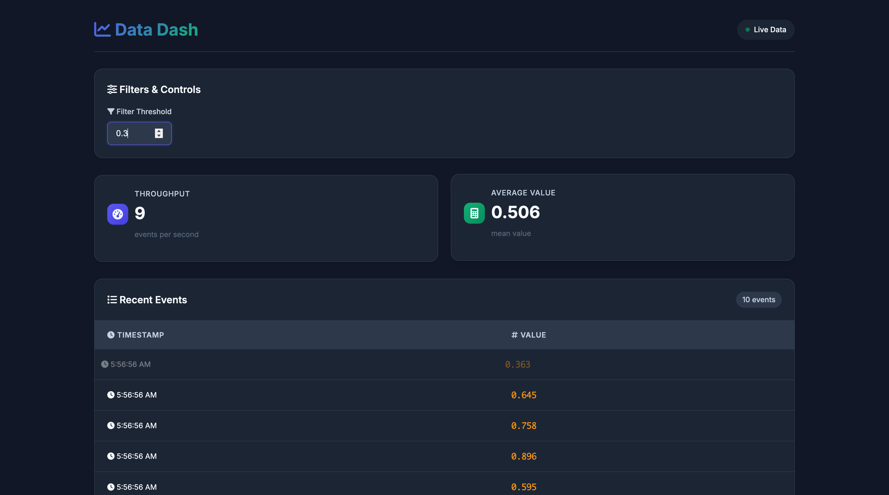

<h1 align="center">📊 Data Dash — Real-Time Metrics Dashboard on AWS EKS</h1>

<p align="center">
  <!-- project banner -->
  
  <br>
  <!-- CI badge -->
  <a href="https://github.com/ethicalzeus07/datadash-eks/actions/workflows/build.yml">
    
  </a>
</p>

> **Data Dash** is a tiny FastAPI + WebSocket app that streams fake events and renders live KPIs in the browser.  
> I built it to deepen my hands-on skills with **Docker, GitHub Actions, Amazon ECR, EKS Fargate, ALB Ingress, and Kubernetes**.  
> 👉 [Check out the LinkedIn post](https://www.linkedin.com/feed/update/urn:li:activity:7357399774645395456/) for project highlights and demo screenshots.

---

## ✨ Features
| Category         | What it does                                                                 |
|------------------|------------------------------------------------------------------------------|
| **Live metrics** | Streams timestamped events at ±20 rps, shows latest value, moving average, throughput, & filtering |
| **Cloud native** | End-to-end container workflow: build → push → deploy via GitHub Actions      |
| **Serverless infra** | Runs on **EKS Fargate**—no EC2 nodes to manage                              |
| **Ingress & ALB**| Public routing: Browser → ALB → Ingress → Service → Pod                      |
| **Cost-aware**   | Infra is deleted when not in use; only the demo image remains in ECR         |

---

## 🗺️ Architecture

```mermaid
flowchart LR
    Browser -- WS / HTTP --> ALB
    ALB --> Ingress
    Ingress --> Service
    Service --> Pod[(FastAPI ⬌ static HTML)]

    subgraph "Amazon EKS Fargate"
        Pod
    end

    CI[GitHub&nbsp;Actions] --> ECR[(Amazon ECR)]
    ECR --> EKS[(Amazon EKS)]
