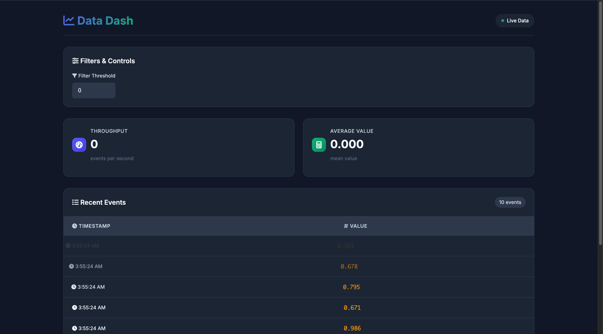

<h1 align="center">🕹️ Data Dash — real-time metrics game on AWS EKS</h1>

<p align="center">
  <br>
  <!-- CI badge links to the latest workflow run -->
  <a href="https://github.com/ethicalzeus07/datadash-eks/actions/workflows/build.yml">
    
  </a>
</p>

> **What it is**  
> A tiny FastAPI + JavaScript WebSocket game that streams fake events and renders live KPIs.  
> **Where it runs**  
> Fully containerised, pushed to Amazon ECR, and deployed on **EKS Fargate** behind an **Application Load Balancer**.

---

### 🗺️ Architecture (Mermaid)

```mermaid
flowchart LR
    Browser -- WS / HTTP --> ALB
    ALB --> Service
    Service --> Pod[(FastAPI ⬌ static HTML)]

    %% group the pod inside EKS Fargate
    subgraph "Amazon EKS Fargate"
        Pod
    end
